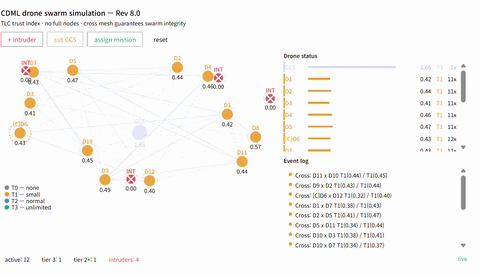

# CDML — A DAG Consensus That Works Without Full Nodes



**Drone Swarm Demo (No Full Nodes)**  
A swarm of drones coordinating missions without any full node.

→ No global state  
→ No full nodes  
→ Real-time consensus via DAG

> **"What if a blockchain didn't need full nodes?"**

[](https://github.com/andogi7777/cdml/actions/workflows/go.yml)
[](https://opensource.org/licenses/Apache-2.0)
[](https://golang.org)
[]()

---

## The Universal Assumption of Every Blockchain

Traditional blockchains — every blockchain shares one premise:

**Someone, somewhere, must store the entire ledger.**

Full nodes. Archive nodes. Validators holding the entire state. Removing them was considered impossible — without them, transactions can't be verified, double-spends can't be detected, consensus breaks down.

**We removed them. It still works.**

---

## What is CDML

CDML (Cross-Density Mutual Surveillance Ledger) is a DAG-based distributed ledger that operates **without full nodes, archive nodes, or global consensus**.

Instead of one entity holding everything, **the sum of cross-validation records between nodes forms a distributed full node.**

Every time two nodes exchange state hashes (a "cross"), a mutual surveillance record is created. An attacker attempting to forge past records must simultaneously modify cross records spanning hundreds of unrelated nodes.

Being DAG-based, CDML supports parallel transaction processing, enabling high TPS scalability that traditional block-structured chains cannot achieve.

```
Traditional Blockchain:          CDML:
┌─────────────────┐          A ←→ B ←→ C
│   Full Node     │          ↕       ↕
│ (stores all)    │      D ←→ E ←→ F
└─────────────────┘          ↕       ↕
  Single point            G ←→ H ←→ I
  of failure
                     Every cross = a witness.
                     Sum of crosses = distributed full node.
```

---

## Why This Matters

| Property | Traditional blockchains | CDML |
|---|---|---|
| Full node required | ✅ Required | ❌ Not required |
| Archive node required | ✅ Required | ❌ Not required |
| Global consensus | ✅ Required | ❌ Not required |
| Storage per node | Entire chain | Cross history only |
| Confirmation time | 10 min ~ 2 sec | ~1–1.5 seconds |
| Storage growth | Linear, permanent | Compressed per cross |
| TPS scalability | Limited by block structure | Scalable via DAG parallel processing |

---

## Use Cases

### Drone Networks
- Unstable connectivity environments  
- Swarm coordination without central control  
- Works under intermittent links  

---

### Disaster Communication
- No infrastructure available  
- Peer-to-peer communication  
- Reliable data sharing in emergencies  

---

### IoT Systems
- Low-power devices  
- Intermittent network  
- Lightweight validation without full nodes  

| Environment | Problem | CDML Solution |
|------------|--------|--------------|
| Drone | Unstable network | Cross-validation DAG |
| Disaster | No infrastructure | P2P consensus |
| IoT | Resource limits | No full nodes |

---

## Architecture

```
┌─────────────────────────────────────────────────┐
│                   API Layer                      │
│         REST Endpoints (balance, tx, status)     │
├─────────────────────────────────────────────────┤
│                Protocol Layer                    │
│   TxProcessor │ DAGManager │ WitnessManager      │
├─────────────────────────────────────────────────┤
│                Crypto Layer                      │
│   Ed25519 │ Blake2b-256                          │
├─────────────────────────────────────────────────┤
│                Storage Layer                     │
│   BadgerDB │ ChainStore │ CrossStore             │
├─────────────────────────────────────────────────┤
│                Network Layer                     │
│   TCP P2P │ Gossip │ NonceLock                   │
└─────────────────────────────────────────────────┘
```

**No full node. No archive. No global state sync.**

---

## Transaction Flow

```
1. Sender constructs TX (snapshot + merkle root)
2. NonceLock broadcast → double-spend preemption
3. TxVerify sent to active witnesses
4. Each witness validates and returns signature
5. Quorum reached → ConfirmTx atomic write

Confirmation time: ~1–1.5 seconds. No mempool. No blocks. No waiting.
```

---

## Quick Start

```bash
# Clone and build
git clone https://github.com/andogi7777/cdml
cd cdml
go mod tidy
go build -o testnet/cdml.exe ./cmd/cdml   # Windows
go build -o testnet/cdml    ./cmd/cdml   # Linux/Mac

# Generate testnet config (5 nodes)
go run scripts/localnet/setup.go

# Start all nodes
testnet\start_all.bat         # Windows
./testnet/start_all.sh        # Linux/Mac

# Initialize (fund balances + register witnesses)
go run scripts/localnet/init.go

# Check status
go run scripts/cli/main.go status
```

---

## Scope of Release

This is a Research Preview. The infrastructure layer is open-sourced to demonstrate that a full-node-free design actually works.

**Public:**
- P2P networking layer (TCP, Gossip)
- Transaction signing and basic verification flow
- DAG management and storage layer
- Basic quorum mechanism
- 5-node local testnet scripts

**Private (under active research):**
- TLC calculation formula
- Cross-partner selection algorithm
- Dynamic witness rotation mechanism
- Stake slashing enforcement

---

## Contributing

```
Issues:  Bug reports, design challenges, attack vectors
PRs:     Infrastructure layer only (network, storage, crypto)
```

Core protocol changes (consensus, witness selection, TLC) require prior discussion.

**Contact:** andogi@naver.com

---

## License

Apache 2.0 — Use it, fork it, learn from it.

The core consensus mechanism (TLC + cross-based trust) is patent pending.
This is a precautionary measure only — to prevent early monopolization by any single entity.
It is not intended to restrict open research or development.

---

## Citation

```
CDML: Cross-Density Mutual Surveillance Ledger
A full-node-free, cross-based mutual surveillance DAG ledger
https://github.com/andogi7777/cdml
```

---

*"We didn't build a better blockchain. We asked whether its most fundamental assumption was necessary."*
